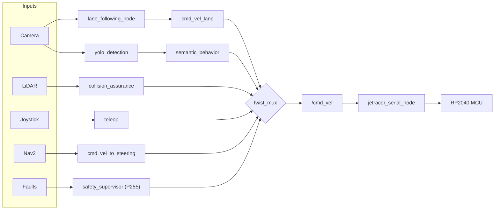

<div align="center">

# JetRacer ROS 2

**Autonomy | Safety | Jetson Nano Optimized**

[](https://docs.ros.org/en/humble/)
[](docs/00_ROS2-Jetson-Nano.md)
[](https://developer.nvidia.com/embedded-computing)
[](https://docs.docker.com/)
[](https://docs.docker.com/compose/)
[](https://navigation.ros.org/)
[](https://github.com/SteveMacenski/slam_toolbox)
[](https://docs.ros.org/en/humble/Tutorials/Intermediate/RViz/RViz-User-Guide/RViz-User-Guide.html)
[](https://foxglove.dev/)
[](#production-hardening-roadmap)
[](#-active-diagnostics)
[](#one-button-mission-control)
[](#onboard-telemetry)
[](https://developer.nvidia.com/embedded-computing)
[](#machine-learning-yolo-training)
[](#-exporting-for-jetson-tensorrt)
[](#machine-learning-yolo-training)

*Professional grade ROS 2 Humble transformation for the Waveshare JetRacer platform. Designed for stability, deterministic control, and comprehensive observability.*

</div>

---

## What is this?

A **production-grade ROS 2 Humble** autonomous driving stack for the [Waveshare JetRacer](https://www.waveshare.com/wiki/JetRacer_ROS_AI_Kit) running on an NVIDIA Jetson Nano. The platform transforms a hobby RC car into a multi-modal autonomous system with deterministic safety arbitration, real-time perception, SLAM-based mapping, and a Gazebo simulation environment — all decoupled into independent, composable ROS 2 packages.

---

## Package Architecture

| Package | Role | Key Nodes |
| :--- | :--- | :--- |
| `jetracer_bringup` | Launch orchestration, global config | — (launch + config only) |
| `jetracer_description` | URDF, TF geometry, RViz assets, joint animator | `joint_state_publisher.py` |
| `jetracer_gazebo` | Gazebo Harmonic simulation — camera, LiDAR, IMU, Ackermann drive | `simulation.launch.py` |
| `jetracer_hardware` | C++ serial bridge, LiDAR, thermal monitor, calibration | `jetracer_serial_node`, `thermal_monitor.py` |
| `jetracer_localization` | EKF sensor fusion → `/odom` | `robot_localization` (EKF) |
| `jetracer_perception` | CSI camera, lane following, YOLO11 detection, classical trackers | `lane_following_node.py`, `yolo_detection.py` |
| `jetracer_lane_following` | BEV sliding-window lane follower with Stanley/MPC control | `lane_following_node.py` |
| `jetracer_behavior` | Safety supervisor, collision assurance, semantic stop, slip monitor | `safety_supervisor.py`, `collision_assurance.py`, `semantic_behavior.py` |
| `jetracer_navigation` | Nav2 integration, SLAM, Ackermann adapter, multipoint patrol | `cmd_vel_to_steering.py`, `multipoint_nav.py` |
| `jetracer_teleop` | Keyboard and joystick teleoperation | `teleop_key.py`, `teleop_joy.py` |
| `jetracer_voice` | Offline ASR/TTS, voice command goal dispatch | `voice_commander.py`, `vad.py` |

---

## Stack Overview



**Arbitration priorities** (`twist_mux`):

| Topic | Priority | Publisher |
| :--- | :---: | :--- |
| `cmd_vel_safety` | **255** | `safety_supervisor` — battery, thermal, hardware faults |
| `cmd_vel_teleop` | 10 | Gamepad / keyboard |
| `cmd_vel_behavior` | 8 | `semantic_behavior`, `collision_assurance` |
| `cmd_vel_lane` | 5 | Lane follower |
| `cmd_vel_vision` | 4 | Classical vision trackers |
| `cmd_vel_nav_steer` | 3 | Nav2 (after Ackermann adaptation) |

---

## Quick Start

### 1. Jetson Nano host setup

```bash
# Apply the Ubuntu 20.04 workaround for ROS 2 Humble on Jetson
# See docs/00_ROS2-Jetson-Nano.md for details
```

### 2. Build

```bash
# Containerized (recommended)
docker compose up -d --build
docker exec -it jetracer_workspace bash

colcon build --symlink-install --cmake-args -DCMAKE_BUILD_TYPE=Release
source install/setup.bash

# Register the systemd autostart service
bash install_service.sh
```

### 3. Launch

```bash
# Base hardware + safety + twist_mux only
ros2 launch jetracer_bringup jetracer.launch.py

# Full autonomous stack (lane following + YOLO + behavior nodes)
ros2 launch jetracer_bringup autonomy.launch.py

# Navigation + SLAM
ros2 launch jetracer_bringup nav.launch.py

# Safe mode (caps speed at 0.20 m/s)
ros2 launch jetracer_bringup autonomy.launch.py safe_mode:=true

# Dry run (no motor output — safe for testing)
ros2 launch jetracer_bringup autonomy.launch.py dry_run:=true

# Enable autonomous motion after launch
ros2 param set /lane_following start true
```

---

## Simulation

A complete **Gazebo Harmonic** simulation presents the same topic interface as the real hardware — the autonomous stack connects without any code changes.

```bash
# Install prerequisites (one time)
sudo apt install ros-humble-ros-gz gz-harmonic ros-humble-image-transport-plugins

# Build and run
colcon build --packages-select jetracer_gazebo jetracer_description
source install/setup.bash

ros2 launch jetracer_gazebo simulation.launch.py gui:=true use_rviz:=true

# Connect autonomous stack to sim
ros2 launch jetracer_bringup autonomy.launch.py \
    start_camera:=false start_base:=false start_lidar:=false use_sim_time:=true
ros2 param set /lane_following start true
```

> **Safety:** Always use a different `ROS_DOMAIN_ID` for simulation to prevent sim `cmd_vel` from reaching real hardware.

See [docs/13_Gazebo_Simulation.md](docs/13_Gazebo_Simulation.md) for the full guide.

---

## Camera Calibration

The IMX219-160 wide-angle CSI camera **must be calibrated** — the lane follower rectifies frames before the BEV perspective warp.

```bash
ros2 launch jetracer_bringup camera_calibration.launch.py \
    board_size:=5x7 \
    square_size_m:=0.03
```

After the GUI turns green: `CALIBRATE` → `COMMIT`. Default output: `jetracer_perception/config/cam_640x480.yaml`.

See [docs/12_Camera_Calibration.md](docs/12_Camera_Calibration.md).

---

## Teleoperation

Manual control is available at all times and takes priority over all autonomous modes.

```bash
# Keyboard
ros2 launch jetracer_bringup jetracer.launch.py
ros2 run jetracer_teleop teleop_key.py

# Gamepad (hold L2 deadman switch to drive)
ros2 run jetracer_teleop teleop_joy.py
```

---

## YOLO Training Toolkit

The `yolo_toolkit/` directory contains a hardware-optimized training suite for traffic sign recognition:

- **Orientation-aware augmentation** — horizontal flips disabled to preserve sign direction
- **Dataset intelligence** — class imbalance auditing before training runs
- **TensorRT export** — FP16 `.engine` files for >20 FPS inference on Jetson Nano

```bash
# Train
python yolo_toolkit/main.py train

# Export to TensorRT
python yolo_toolkit/main.py export --weights best.pt --half
```

Recognized classes: `STOP`, `PERSON`, `GIVE_WAY`, `RIGHT_TURN`, `PRIORITY_ROAD`, `CHILD`, `ATTENTION`, `30_ZONE_BEGIN/END`.

See [yolo_toolkit/README.md](yolo_toolkit/README.md).

---

## Safety

| Mechanism | Detail |
| :--- | :--- |
| `safety_supervisor` at P255 | Halts on battery < 9.5V, temp > 82°C, hardware fault, wheel slip |
| Fail-safe watchdog | Any safety feed silent > 2 s activates the corresponding fault |
| `start: false` default | All autonomous nodes are motion-gated — explicit opt-in required |
| Command timeout | Serial node zeroes commands after 1 s of silence |
| `dry_run` mode | Suppresses all serial motor writes — safe for software testing |
| Teleop awareness | Soft faults suppressed when human operator is on joystick |

---

## Diagnostics

```bash
# Monitor all diagnostic topics
ros2 topic echo /diagnostics

# Live system health
ros2 run rqt_runtime_monitor rqt_runtime_monitor
```

Monitored: serial port health, IMU/odom update rates, thermal zones (GPU/CPU/PLL/AO), wheel slip divergence, battery voltage.

---

## Testing

```bash
colcon test --packages-select jetracer_bringup
colcon test-result --all
```

---

## Documentation

| Guide | Link |
| :--- | :--- |
| System Overview | [docs/01_System_Overview.md](docs/01_System_Overview.md) |
| Hardware & Assembly | [docs/02_Hardware_and_Assembly.md](docs/02_Hardware_and_Assembly.md) |
| Deployment & Docker | [docs/03_Deployment_and_Docker.md](docs/03_Deployment_and_Docker.md) |
| Perception Stack | [docs/04_Perception_Stack.md](docs/04_Perception_Stack.md) |
| Navigation & SLAM | [docs/05_Navigation_and_SLAM.md](docs/05_Navigation_and_SLAM.md) |
| Behavior & Arbitration | [docs/06_Behavior_and_Arbitration.md](docs/06_Behavior_and_Arbitration.md) |
| Central Configuration | [docs/08_Central_Configuration.md](docs/08_Central_Configuration.md) |
| Technical Architecture | [docs/09_Technical_Architecture.md](docs/09_Technical_Architecture.md) |
| Camera Calibration | [docs/12_Camera_Calibration.md](docs/12_Camera_Calibration.md) |
| Gazebo Simulation | [docs/13_Gazebo_Simulation.md](docs/13_Gazebo_Simulation.md) |
| RViz2 Workflow | [docs/rviz2_workflow.md](docs/rviz2_workflow.md) |
| YOLO Toolkit | [yolo_toolkit/README.md](yolo_toolkit/README.md) |

Full docs site: `pip install -r requirements-docs.txt && mkdocs serve`

