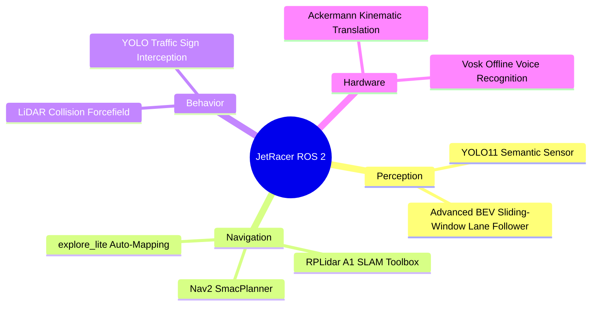

# 1. JetRacer System Overview

Welcome to the **JetRacer ROS 2 Platform**, a culmination of AI, Robotics, and enterprise-grade software architecture. Originally a simple toy based on ROS 1, this repository transforms the Waveshare JetRacer Pro hardware into a fully decoupled, async-interrupted Level 3 Autonomous Robotics platform.

## What is it?

The JetRacer is an Ackermann-steered (car-like) mobile robot powered by an NVIDIA Jetson Nano. 

Instead of relying on single massive scripts to drive the car, this repository utilizes **Decoupled Node Arbitration**. It boasts an independent mathematical perception stack, an independent mechanical mapping stack, and an independent offline audio processor. All these stacks compete for physical hardware control through a rigidly defined Priority Multiplexer (`twist_mux`).

## Core Capabilities

### Key Features

1. **Semantic Awareness**: Instead of just following colors, the JetRacer understands what objects are (e.g. Stop Signs) and reacts operationally.
2. **Auto-Mapping**: Using `explore_lite`, the JetRacer can be deployed in a room and will mathematically drive itself around until a perfect 2D map is generated.
3. **Hardware Fail-Safes**: The camera AI is fast, but it possesses no depth perception. The spinning LiDAR mechanically acts as an override—forcefully braking the car if a physical object violates its safety cone.
4. **Offline Interactivity**: Totally isolated from the Cloud, the vehicle utilizes a USB mic and PyAudio/Vosk to parse human words like "Kitchen", triggering complex routing behaviors automatically.
5. **Centralized Configuration**: Not a single python file needs to be edited to tune the robot. Everything from LiDAR cones distances to YOLO confidence thresholds is governed by a singular `.yaml` file.

> [!TIP]
> **Next Step:** Continue to [02. Hardware and Assembly](02_Hardware_and_Assembly.md) to review the exact parts powering this platform.
