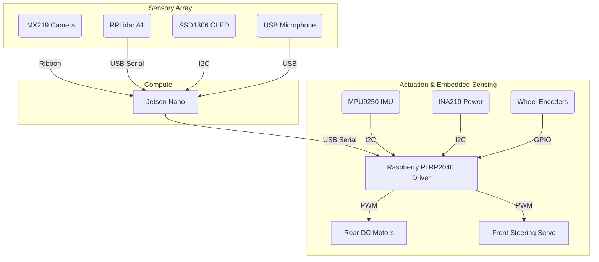

# 02. Hardware and Assembly

The JetRacer ROS 2 platform is built atop the mechanical chassis provided by the Waveshare JetRacer AI Kit, but significantly upgraded with external telemetry hardware.

## Bill of Materials (BOM)

| Component | Purpose | Interface |
| :--- | :--- | :--- |
| **NVIDIA Jetson Nano (4GB)** | Core Brain. Handles CUDA accelerated YOLO inference and Nav2 spatial math. | Host |
| **Waveshare JetRacer Pro Chassis** | The Ackermann steering frame and DC motors. | Mechanical |
| **RP2040 Microcontroller** | Acts as the real-time embedded motor driver handling I2C signals. | I2C |
| **Sony IMX219 (8MP)** | The physical eye of the car tracking lines and objects. | CSI Ribbon Cable |
| **RPLidar A1M8** | 360° laser scanner providing depth and maps up to 12 meters away. | USB (Serial) |
| **MPU9250 AHRS IMU** | 9-DOF Absolute Orientation Sensor. Interfaced via RP2040 Serial Bridge. | Serial (via RP2040) |
| **INA219 Monitor** | Precise Voltage/Current sensing for power health. | I2C (via RP2040) |
| **SSD1306 OLED** | Real-time status display (IP, Battery, Faults). | I2C (Direct to Jetson) |
| **Wheel Encoders** | Hall-effect sensors determining raw physical forward momentum (Odometry). | GPIO -> RP2040 |
| **USB Microphone** | Allows voice-activated routing commands. | USB |
| **Standard Wireless Gamepad** | Teleoperation, Deadman-switch, and Mission Control Sentinel. | Bluetooth / USB |

## Physical Architecture and Mounting

### Important Hardware Quirks
>
> [!WARNING]  
> **The Encoder-IMU Divide**: Because cheap IMUs drift horribly when mathematically double-integrating Acceleration into Linear Speed, our Sensor Fusion explicitly ignores the IMU's Linear Acceleration. Linear speed is derived EXCLUSIVELY from your Wheel Encoders. The IMU is mathematically isolated to only provide precise **Yaw-Rate (Rotation)**.

> [!CAUTION]
> **Ackermann Kinematics**: Because this is a car-like robot, the motors cannot turn the robot 'in place' like a vacuum cleaner. All Nav2 calculations must pass through our `cmd_vel_to_steering.py` inverse-kinematic converter, which measures the hardware wheelbase ($0.255m$) to calculate the precise angular curvature of the steering servo.

---
> [!TIP]
> **Next Step:** Proceed to [03. Deployment and Docker](03_Deployment_and_Docker.md) to set up the software environment.
