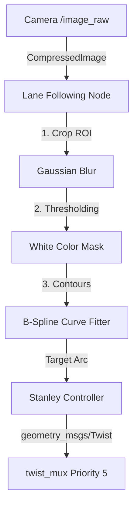
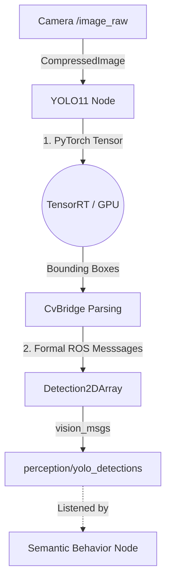

# 04. Perception Stack

The **`jetracer_perception`** package translates raw analog light hitting the IMX219 lens into actionable numerical mathematics. 

## Two Distinct Engines

We utilize two completely isolated perception layers, achieving different tasks simultaneously:

### 1. The High-Speed Reactive Tracker
**File:** `lane_following_node.py`

When the car needs to race at high speeds on a track, computational latency must be under `10ms`. Because deep mathematical pipelines (like Neural Nets processing pixels) introduce lag, the Lane Follower relies strictly on ultra-fast OpenCV thresholding algorithms.

- **Workflow:** Slices the bottom third of the camera frame $\to$ Applies Gaussian Blurring $\to$ Isolates White lines $\to$ Calculates geometric Contours.
- **Actuation:** It passes these physical contours into a proprietary **B-Spline Curve Fitter**. This mathematically calculates the actual Arc of the upcoming corner, feeding it to a rigid **Stanley Controller** to compute the perfect steering `cmd_vel` output in microseconds.

### 2. The Deep-Learning Semantic Tracker
**File:** `yolo_detection.py`

While the Lane Follower acts as the "Spinal Cord" (pure high-speed reflexes), the YOLO module acts as the "Cerebral Cortex" (complex understanding).

- **Workflow:** Feeds identical PyTorch optimized 640x480 matrices into an Ultralytics YOLO11 Neural Network utilizing hardware TensorRT acceleration directly on the Maxwell GPU.
- **Actuation:** It does *not* steer the car. It simply broadcasts `vision_msgs/Detection2DArray` messages. This means it publishes: *"I see a Stop Sign at X: 350, Y: 120 with Confidence 0.88"*. It leaves it up to the [Behavior Node](06_Behavior_and_Arbitration.md) to decide what to actually do about that Stop Sign!

---
> [!TIP]
> **Next Step:** Explore how the car finds its way around unseen rooms dynamically via mapping in [05. Navigation and SLAM](05_Navigation_and_SLAM.md).
