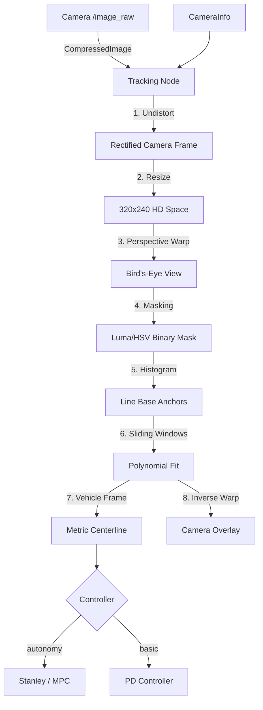
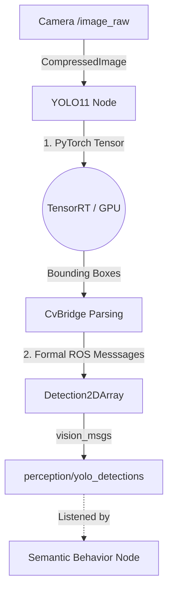

# 4. Perception Stack

The **`jetracer_perception`** package translates raw analog light hitting the IMX219 lens into actionable numerical mathematics. 

## Two Distinct Engines

We utilize two completely isolated perception layers, achieving different tasks simultaneously:

### 1. The High-Speed Reactive Tracker

**File:** `lane_following_node.py`

When the car needs to follow a path at high speeds, computational latency must be under `10ms`. The lane following pipeline utilizes a robust, deterministic Computer Vision foundation optimized for physical hardware.



- **Stack-Wide Consistency:** Both the primary racer (`lane_following_node.py`) and the generic color tracker (`line_follow.py`) now benefit from the **Bird's-Eye View** and **Sliding Window** architecture.
- **Lens-Aware Runtime:** The lane follower now consumes `csi_cam_0/camera_info` and rectifies the wide-angle IMX219 image before applying the fixed BEV warp.
- **Resolution Shift:** Operates at **320x240**, providing 3.3x more pixel density than legacy ports.
- **Bird's-Eye View (BEV):** Uses a `cv2.warpPerspective` matrix to transform the road into a top-down view for parallel line math.
- **Robust Tracking:** The **Sliding Window** approach enables the car to "follow" lines through gaps or shadows by maintaining momentum from previous frames.
- **Deterministic Control:** Controllers now consume the centerline in BEV-derived vehicle coordinates, while the inverse projection is kept only for debug overlays.

### Camera Calibration Workflow

The JetRacer ROS kit ships with a wide-angle IMX219-160 camera. Calibration is required for consistent lane geometry, AprilTag pose estimates, and image-space overlays.

```bash
ros2 launch jetracer_bringup camera_calibration.launch.py \
  board_size:=5x7 \
  square_size_m:=0.03
```

- `board_size` is the checkerboard inner-corner count in `cols x rows`.
- `square_size_m` is the physical checker size in meters.
- The calibration GUI subscribes to `/csi_cam_0/image_raw` and commits through `/csi_cam_0/set_camera_info`.
- The default calibration file is `jetracer_perception/config/cam_640x480.yaml`.

See [12. Camera Calibration](12_Camera_Calibration.md) for the full procedure.

### 2. The Deep-Learning Semantic Tracker

**File:** `yolo_detection.py`

While the Lane Follower acts as the "Spinal Cord" (pure high-speed reflexes), the YOLO module acts as the "Cerebral Cortex" (complex understanding).



- **Workflow:** Feeds identical PyTorch optimized 640x480 matrices into an Ultralytics YOLO11 Neural Network utilizing hardware TensorRT acceleration directly on the Maxwell GPU.
- **Actuation:** It does *not* steer the car. It simply broadcasts `vision_msgs/Detection2DArray` messages. This means it publishes: *"I see a Stop Sign at X: 350, Y: 120 with Confidence 0.88"*. It leaves it up to the [Behavior Node](06_Behavior_and_Arbitration.md) to decide what to actually do about that Stop Sign!

---
> [!TIP]
> **Next Step:** Explore how the car finds its way around unseen rooms dynamically via mapping in [05. Navigation and SLAM](05_Navigation_and_SLAM.md).
