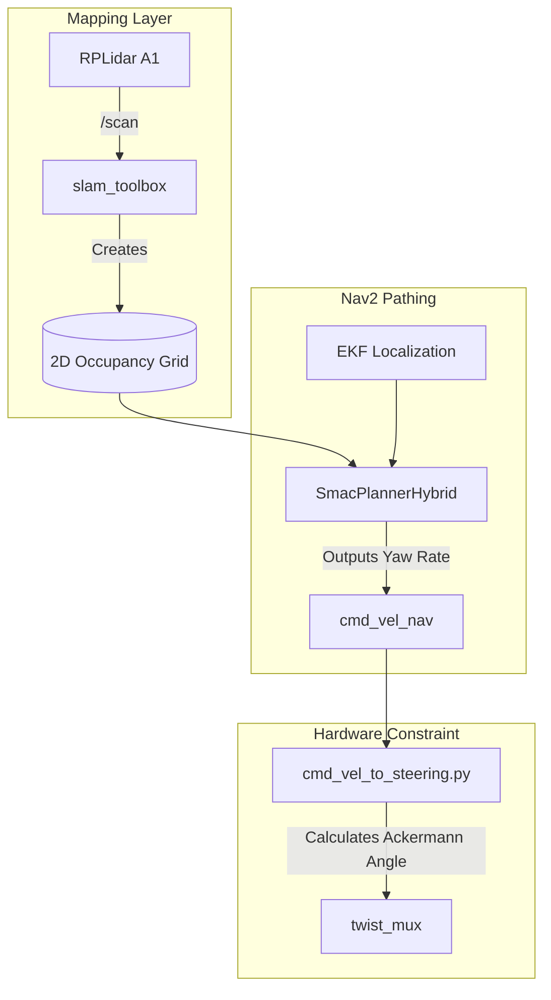

# 05. Navigation and SLAM 

The **`jetracer_navigation`** and **`jetracer_localization`** packages merge incoming geometric and dynamic signals to physically locate the robot within a room and chart the mathematically optimal track line over multiple rooms.

## Sensor Fusion (The EKF)

A solitary sensor is untrustworthy. Encoders slip on dust (predicting infinite speed). IMUs succumb to electromagnetic drift when passing heavy wiring (distorting your sense of North). 

Using the `robot_localization` ROS 2 package, we construct an **Extended Kalman Filter (EKF)** that mathematically averages the sensors simultaneously:

- **Gyroscopic Yaw:** Handled exclusively by the **MPU9250** AHRS Sensor (fused onboard the MCU).
- **Linear Drive:** Handled exclusively by the Hall-Effect **Wheel Encoders**.
- **Constraint Handling**: We explicitly drop the IMU's raw Linear Acceleration vectors from the EKF array (`ekf.yaml`) because double-integrating them on 4GB compute introduces wild algorithmic runaway. Instead, we use raw angular velocity for rotation damping.

## Autonomous 2D Pathfinding

### Navigating Like a Car
Robots like Roombas use "Differential Drive"—meaning they mathematically output trajectories that demand turning in place. 
Your JetRacer uses a physical rack-and-pinion front axis. Therefore:
1. Nav2 relies on the **SmacPlannerHybrid**, configuring exclusively to an `ACKERMANN` motion model with a locked $0.40m$ turning radius. 
2. **Localization Stability**: AMCL is configured with the `nav2_amcl::DifferentialMotionModel`, which provides the most stable approximation for car-like localization in Nav2 without demanding non-existent lateral motion sensors.
3. The `cmd_vel_to_steering.py` inverse kinematics script physically maps the requested Yaw rotation to your vehicle's physical $0.255m$ wheelbase, ensuring the tires actually pivot to the exact geometric angle requested by the AI.

### Safety & Supervision
The navigation stack is supervised by the **`safety_supervisor`** node, which monitors LiDAR data for immediate obstacles and thresholds for wheel slip and battery health. If a critical fault occurs, the autonomous plan is immediately preempted by a hardware halt.

---
> [!TIP]
> **Next Step:** Understand how we stop simultaneous sensors from overriding each other in [06. Behavior and Arbitration](06_Behavior_and_Arbitration.md).
