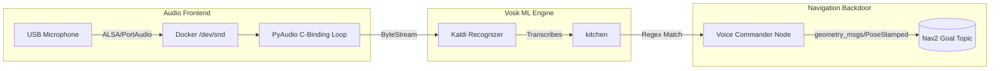

# 07. Voice Commander Stack

The **`jetracer_voice`** package elevates the JetRacer platform into a fully interactive robotic agent, providing Natural Language actuation pathways completely offline.

## Why Offline?
Many robot frameworks lazily employ cloud transcription APIs (e.g., Google STT or AWS). If your local Internet cuts out, your robot is paralyzed.

Instead, we employ `Vosk`. Vosk utilizes tiny quantized acoustic and language models that execute locally on the Jetson Nano CPU, mapping raw incoming audio signals to phonemes and grammar graphs without ever broadcasting your local voice arrays externally.

## Architecture

## How Delivery Works

Inside `voice_commander.py`, we execute a high-cycle polling loop.
1. `PyAudio` extracts 4,000-byte buffers directly from `/dev/snd`.
2. The buffer mathematically passes through `KaldiRecognizer`.
3. If the resulting JSON string possesses the word `kitchen`, the Thread locks immediately.
4. It reads the internal $X$, $Y$ destination vectors hardcoded out of `main_config.yaml`.
5. It crafts a formal `PoseStamped` message indicating exactly where the car needs to go inside its 2D Map coordinate system.
6. It formally dictates this target structure over the `/goal_pose` network. Nav2 receives it seamlessly, plotting a trajectory!

---
> [!TIP]
> **Next Step:** End your journey logically at [08. Central Configuration](08_Central_Configuration.md) to tweak all the values making this possible.
