# 9. Technical Architecture

This document is a code-level architecture reference for the ROS 2 stack under `src/`.

It complements the higher-level overview pages by documenting:

- package boundaries and build model
- launch composition and runtime profiles
- topic contracts and command arbitration
- localization/navigation/perception/control internals
- parameter/config layering
- safety behavior and known architectural caveats

## 1. Architecture Scope

The workspace implements a modular ROS 2 system for an Ackermann JetRacer platform with these major planes:

- **Hardware plane**: serial motor/IMU/odom bridge + LiDAR bringup/filtering.
- **State-estimation plane**: EKF fusion into a canonical `/odom`.
- **Perception plane**: camera + classical vision + YOLO detections.
- **Behavior plane**: semantic and LiDAR emergency override logic.
- **Planning plane**: Nav2 + SLAM + multipoint patrol + map tooling.
- **Command plane**: topic-priority arbitration and command adaptation.
- **Human I/O plane**: teleop + voice capture/TTS/ASR helpers.

## 2. Package Topology

| Package | Build Type | Primary Role | Installed Executables |
|---|---|---|---|
| `jetracer_bringup` | `ament_cmake` | Cross-package launch orchestration | launch-only package |
| `jetracer_description` | `ament_cmake` | URDF/xacro, TF geometry, RViz assets, joint state animator | `joint_state_publisher.py` |
| `jetracer_gazebo` | `ament_cmake` | Gazebo Harmonic simulation (Ackermann drive, camera, LiDAR, IMU) | launch-only package |
| `jetracer_hardware` | `ament_cmake` | MCU serial bridge, LiDAR launch, scan filtering, calibration | `jetracer_serial_node`, `laser_filter.py`, `calibrate_linear.py` |
| `jetracer_localization` | `ament_cmake` | EKF localization launch/config | launch-only package |
| `jetracer_perception` | `ament_cmake` | Camera and vision nodes (classical + YOLO) | `color_tracking.py`, `object_tracking.py`, `motion_detect.py`, `face_detect.py`, `yolo_detection.py` |
| `jetracer_lane_following` | `ament_cmake` | High-speed lane-following pipeline with selectable lateral control (`stanley`/`mpc`) | `lane_following_node.py` (+ installed math libs) |
| `jetracer_navigation` | `ament_cmake` | Nav2 integration, `rrt_star_planner` | Provides high-level path planning (Nav2) and local obstacle avoidance (RRT*) and converts generic geometry `Twist` to Ackermann `Twist`. | `cmd_vel_to_steering.py`, `multipoint_nav.py` |
| `jetracer_behavior` | `ament_python` | Priority safety/semantic behavioral overrides | `semantic_behavior.py`, `collision_assurance.py`, `safety_supervisor.py`, `slip_monitor.py` |
| `jetracer_teleop` | `ament_cmake` | keyboard/joystick teleoperation | `teleop_key.py`, `teleop_joy.py` |
| `jetracer_voice` | `ament_cmake` | VAD/ASR/TTS/assistant helpers | `vad.py`, `tts_en.py`, `tts_cn.py`, `voice_commander.py`, `ginput.py`, `iat.py`, `aiui.py` |

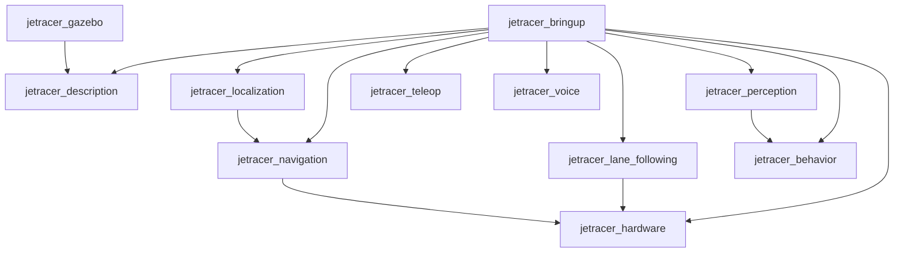

## 3. Build and Packaging Model

### 3.1 Build-system split

- Most packages are **`ament_cmake`** and install Python scripts via `install(PROGRAMS ...)` into `lib/<package>`.
- `jetracer_behavior` is **`ament_python`** with setuptools console scripts.

### 3.2 Implications

- Script paths are stable for ROS launch execution (`package + executable`), independent of source-tree location.
- The lane-following libs are installed beside `lane_following_node.py`; the node explicitly adjusts `sys.path` to import sibling modules at runtime.
- `jetracer_localization/scripts/odom_pose_to_odometry.py` is intentionally not installed to avoid duplicate `/odom` publishers when EKF is active.

## 4. Launch Architecture

### 4.1 Layered launch model

`jetracer_bringup` is the orchestration layer. Package-level launches remain the component boundaries.

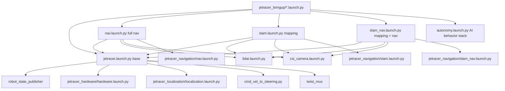

### 4.2 Runtime profiles (what starts what)

- **Base robot profile**: `jetracer_bringup/jetracer.launch.py`
  - robot description publishing
  - serial hardware bridge
  - EKF localization
  - nav command adapter
  - `twist_mux` arbitration
- **Navigation profile**: `jetracer_bringup/nav.launch.py`
  - base profile + LiDAR + camera + Nav2 map-based stack
- **SLAM profile**: `jetracer_bringup/slam.launch.py`
  - base profile + LiDAR + camera + selected SLAM backend
- **SLAM+Nav profile**: `jetracer_bringup/slam_nav.launch.py`
  - base profile + LiDAR + camera + SLAM + Nav2 without map server/AMCL
- **Autonomy AI profile**: `jetracer_bringup/autonomy.launch.py`
  - camera + lane follower + YOLO + behavior nodes + foxglove bridge
  - Additional launch arguments vs. base profile:

| Argument | Default | Description |
|---|---|---|
| `dry_run` | `false` | Suppress all physical motor commands |
| `safe_mode` | `false` | Cap speed at `safe_mode_max_speed_ms` (0.20 m/s) |
| `debug_mode` | `false` | Enable debug image publishing |
| `start_yolo` | `true` | Skip GPU YOLO inference to save memory |
| `start_camera` | `true` | Start CSI camera pipeline |
| `start_base` | `true` | Start hardware + EKF + twist_mux |
| `start_lidar` | `true` | Start RPLidar driver |

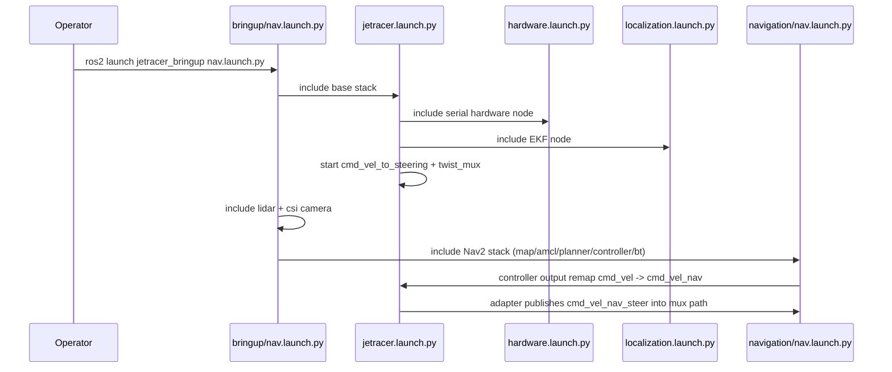

## 5. Command and Arbitration Plane

### 5.1 Contract on `Twist.angular.z`

The stack uses two command semantics:

- **Nav2 internal output** (`cmd_vel_nav`): yaw-rate-like command from Nav2 controllers.
- **Actuator-facing command topics** (`cmd_vel_*` into mux): steering-angle-like command expected by JetRacer MCU.

`cmd_vel_to_steering.py` bridges these semantics for Nav2 by applying:

`steering = atan(wheelbase * angular_z / linear_x)` (with low-speed guard and clamp).

### 5.2 Arbitration path

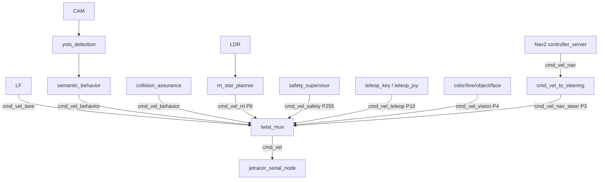

`twist_mux` priorities (`src/jetracer_bringup/config/twist_mux.yaml`):

| Topic | Priority | Timeout | Publisher |
|---|---|---|---|
| `cmd_vel_safety` | **255** | 0.2 s | `safety_supervisor` — hardware faults |
| `cmd_vel_teleop` | 10 | 0.1 s | teleop keyboard / joystick |
| `cmd_vel_behavior` | 8 | 0.3 s | `semantic_behavior`, `collision_assurance` |
| `cmd_vel_rrt` | 6 | 0.5 s | `rrt_star_planner` |
| `cmd_vel_lane` | 5 | 0.3 s | lane follower (legacy Twist) |
| `cmd_vel_vision` | 4 | 0.5 s | classical vision trackers |
| `cmd_vel_nav_steer` | 3 | 0.5 s | Nav2 controller (after steering adapter) |

The lane follower also publishes `drive_lane` (`AckermannDriveStamped`) as the
clean semantic control interface. The existing `twist_mux` chain still consumes
`cmd_vel_lane` for compatibility with the downstream serial bridge.

### 5.3 Safety characteristics in command plane

- All autonomy nodes default to **`start=false`** where motion is possible.
- Teleop nodes publish explicit zero `Twist` when inactive/shutdown.
- Serial node applies `command_timeout_sec` (default `1.0`) and transmits zero command when stale.

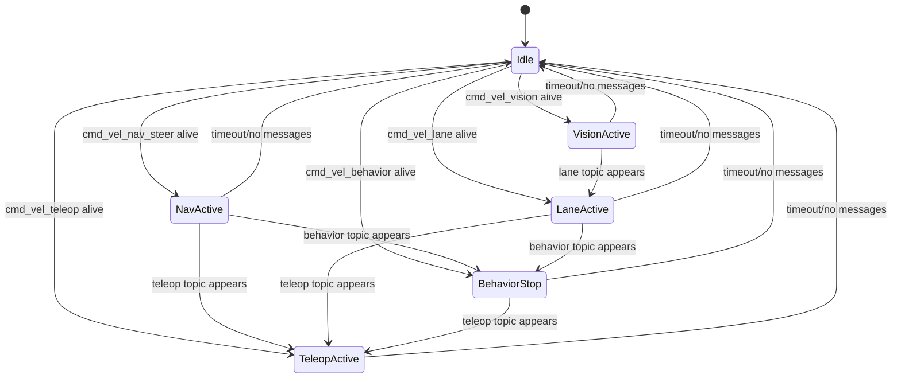

## 6. Hardware and Sensor Plane

## 6.1 `jetracer_serial_node` responsibilities

- Opens serial port (`/dev/ttyACM0` default) and configures UART.
- Publishes:
  - `/imu`
  - `/odom_raw`
  - `/motor/lvel`, `/motor/rvel`, `/motor/lset`, `/motor/rset`
- Subscribes:
  - `/cmd_vel`
- Sends three frame types to MCU:
  - velocity command frame
  - PID/linear/servo parameter frame
  - coefficient frame
- Parses incoming frames using a byte-wise state machine and checksum guard.
- Optionally publishes `odom -> base_footprint` TF (`publish_odom_transform`, default false).

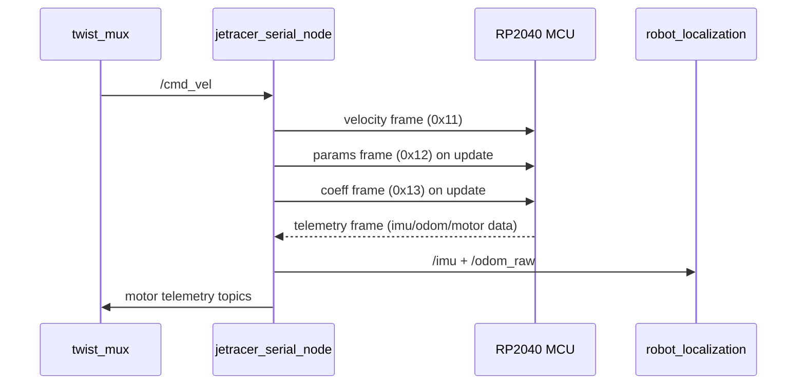

## 6.2 LiDAR and filtering

- `rplidar_ros/rplidar_node` publishes `/scan` (`jetracer_hardware/launch/lidar.launch.py`).
- Optional `laser_filter.py` converts `/scan` to `/filteredscan` via:
  - distance truncation
  - angle-window masking (`laser_angle`).

## 6.3 Calibration helper

`calibrate_linear.py`:

- uses TF (`odom_frame` to `base_frame`) to measure traveled distance
- commands `/cmd_vel` until test-distance error is within tolerance
- can be started/stopped dynamically via `start_test`.

## 7. Localization and TF Plane

## 7.1 EKF fusion (`robot_localization`)

`jetracer_localization/config/ekf.yaml` fuses:

- `odom0: /odom_raw`
- `imu0: /imu`

Key design choices:

- `two_d_mode: true`
- `world_frame: odom`
- EKF output remapped `odometry/filtered -> /odom`
- IMU fusion is restricted to yaw-orientation/yaw-rate channels to avoid contaminating EKF with pre-fused acceleration from MCU AHRS.

## 7.2 TF frame hierarchy

Static/kinematic frames come from URDF (`jetracer.urdf.xacro`) through `robot_state_publisher`:

- `base_footprint`
  - `base_link`
    - steering/wheel joints
    - `camera_link`
    - `imu_link`
    - `laser_link`
    - `jetson_link`

Dynamic frames:

- `odom -> base_footprint`: typically from EKF.
- `map -> odom`: from AMCL (nav mode) or SLAM backend (mapping modes).

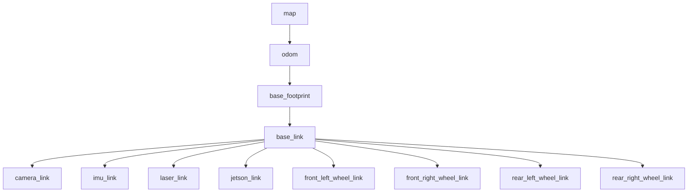

## 8. Perception and Behavior Plane

## 8.1 Camera ingest

`jetracer_perception/launch/csi_camera.launch.py` starts `gscam_node`:

- namespace default: `csi_cam_0`
- topic path includes `image_raw` (+ camera info)
- Jetson-oriented GStreamer pipeline defaults via `nvarguscamerasrc`.
- launch arguments expose capture width, height, FPS, flip method, and calibration file URL.

## 8.2 Lane-following pipeline (High-Definition Autonomy)

`lane_following_node.py` executes per camera frame using a **MultiThreadedExecutor** to isolate high-intensity CV tasks from odometry parsing:

1. compressed image decode
2. optional frame rectification from `CameraInfo`
3. resize to **320x240** (High-Definition space)
4. **Perspective Warp:** transform to Bird's-Eye View (BEV)
5. **Luminance Thresholding:** isolate white tape on black ground
6. **Sliding Window Polynomial Fit:** fit 2nd-degree parabolas to detected pixels
7. keep the solved centerline in BEV and convert it to a pseudo-metric vehicle frame
8. project the same centerline back to camera space only for debug overlays
9. selectable lateral control (`stanley` or `mpc`) + PID longitudinal control
10. publish `drive_lane`, legacy `cmd_vel_lane`, metric waypoints, and debug image

Inputs:

- image: configurable compressed topic (default `csi_cam_0/image_raw/compressed`)
- calibration: `csi_cam_0/camera_info`
- odometry: `/odom`

Outputs:

- `drive_lane` (`AckermannDriveStamped`) — primary Ackermann command
- `cmd_vel_lane` (`Twist`) — legacy compatibility for `twist_mux`
- `lane_following/waypoints` (`Float32MultiArray`) — vehicle-frame waypoints (m)
- `lane_following/waypoints_camera` (`Float32MultiArray`) — camera-space overlay points
- `lane_following/path` (`nav_msgs/Path`) — planned centerline for RViz2
- `lane_following/markers` (`visualization_msgs/MarkerArray`) — lookahead sphere, steering arrow, status cube
- `lane_following/status` (`String`) — `GOOD` / `WEAK` / `LOST`
- `lane_following/confidence` (`Float32`) — tracking confidence 0–1
- `lane_following/control_fps` (`Float32`) — control loop rate
- `lane_following/frame_age_sec` (`Float32`) — camera frame latency
- `lane_following/debug_image/compressed` (`CompressedImage`) — gated at `debug_fps_limit` Hz

Key parameters:

| Parameter | Default | Description |
|---|---|---|
| `start` | `false` | Safety gate — must be set `true` to move |
| `lateral_controller_type` | `stanley` | `stanley` or `mpc` |
| `max_speed_ms` | `0.35` | Maximum forward speed (m/s) |
| `enable_markers` | `true` | Publish RViz2 markers (disable on Jetson to save CPU) |
| `debug_fps_limit` | `5.0` | Max Hz for debug image (bandwidth control) |
| `max_frame_age_sec` | `0.20` | Skip control if camera frame is older than this |

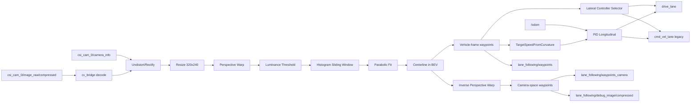

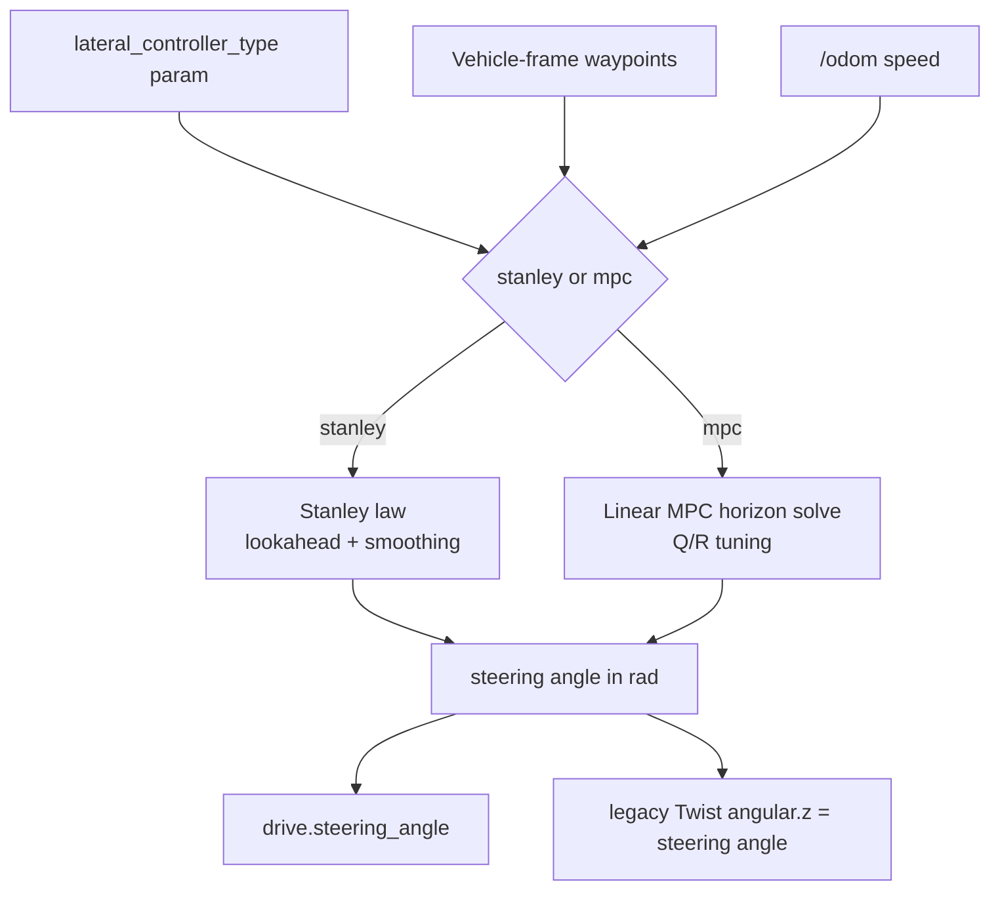

## 8.3 Classical vision behaviors

Nodes publishing `cmd_vel_vision`:

- `color_tracking.py`
- `object_tracking.py`
- `face_detect.py`

Shared pattern:

- compressed image subscribe (queue depth 1)
- start-gated motion output
- annotated debug image publish

Additional outputs:

- `face_detect/count` (int)
- `motion_detect/status` from `motion_detect.py` (non-driving detector).

## 8.4 YOLO semantic detection

`yolo_detection.py`:

- loads Ultralytics model from parameterized `model_path`
- attempts configured device (default `cuda:0`) with CPU fallback on failures
- publishes:
  - `perception/yolo_detections` (`vision_msgs/Detection2DArray`)
  - optional `perception/yolo_debug/compressed`

## 8.5 Behavior override nodes

`semantic_behavior.py`:

- subscribes YOLO detections
- triggers stop if configured class (default `stop sign`) exceeds image-area threshold
- runs timed stop + cooldown state machine
- publishes zero commands on `cmd_vel_behavior` while active

`collision_assurance.py`:

- subscribes `/scan`
- checks forward cone for obstacle under distance threshold
- publishes repeated zero commands on `cmd_vel_behavior` while blocked

Both are priority-8 sources into `twist_mux`.

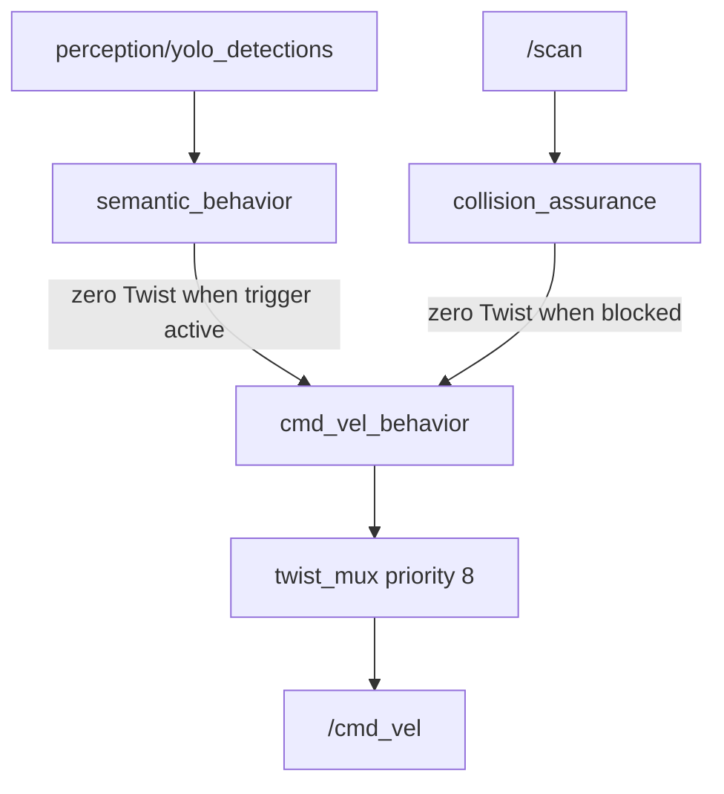

## 9. Navigation, SLAM, and Mission Plane

## 9.1 Nav2 (map-based mode)

`jetracer_navigation/launch/nav.launch.py` starts:

- `map_server`
- `amcl`
- `planner_server`
- `controller_server` (remapped `cmd_vel -> cmd_vel_nav`)
- `behavior_server`
- `bt_navigator`
- lifecycle manager
- optional `multipoint_nav.py`

## 9.2 Planner/controller architecture

From `nav2_params.yaml`:

- Planner: `SmacPlannerHybrid` with `motion_model_for_search: ACKERMANN`.
- Controller: `RegulatedPurePursuitController`.
- AMCL model forced to `OmniMotionModel` as practical approximation for car-like platform.
- Footprint set to chassis-like polygon for both local/global costmaps.

## 9.3 SLAM backends

`slam.launch.py` supports:

- `slam_toolbox` (managed lifecycle node + lifecycle manager)
- `cartographer_ros` (node + occupancy grid node using `config/cartographer/jetracer.lua`)

`slam_nav.launch.py` composes SLAM + Nav2 controller/planner/bt stack for online mapping navigation.

## 9.4 Multipoint mission runner

`multipoint_nav.py`:

- consumes RViz `/clicked_point`
- drives sequential `NavigateToPose` goals via action client
- supports looping and single retry of failed goals
- publishes indexed marker labels for waypoint visualization
- resets patrol list on `initialpose` updates (optional forwarding to alternate topic).

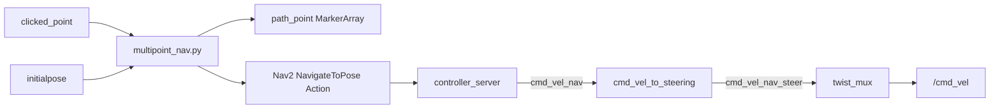

---

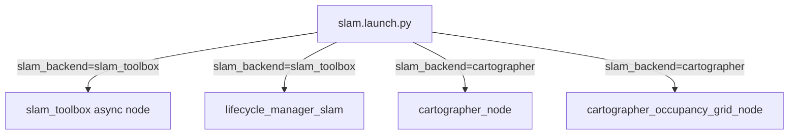

## 10. Voice and Human I/O Plane

## 10.1 Teleop

- `teleop_joy.py`: deadman-button gated joystick to `cmd_vel_teleop`, timer-based publish loop.
- `teleop_key.py`: terminal keyboard control to `cmd_vel_teleop`, with speed scaling bindings.

## 10.2 Voice stack

`vad.py` is a mode-driven orchestrator:

- records VAD-gated utterances to runtime files
- routes to helper scripts (`ginput.py`, `iat.py`, `aiui.py`) based on mode
- publishes recognized text on `chatter`
- optionally plays assistant/TTS audio outputs

TTS subscribers:

- `tts_en.py` subscribes `speak` (gTTS)
- `tts_cn.py` subscribes `speak` (XFYun WebSocket API)

Offline command navigation:

- `voice_commander.py` uses Vosk+PyAudio and publishes `/goal_pose` when keywords are matched.

Credential strategy:

- API secrets are parameterized (not hardcoded).
- Runtime artifacts are written under `~/.ros/jetracer_voice` by default.

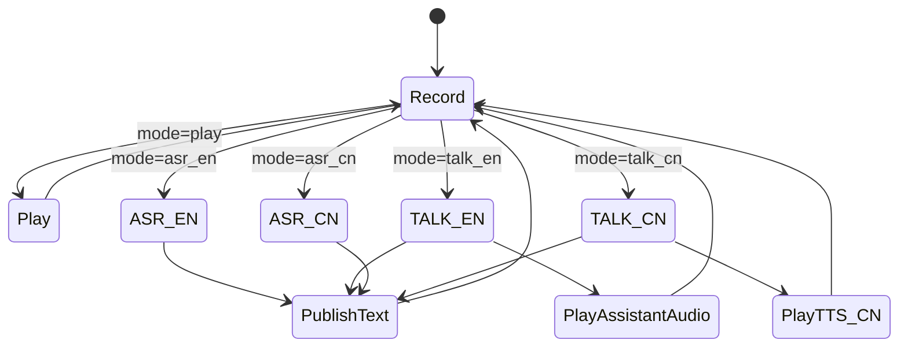

## 11. Topic Contract Reference (Key Runtime Interfaces)

| Topic | Type | Producer(s) | Consumer(s) | Notes |
|---|---|---|---|---|
| `/cmd_vel` | `geometry_msgs/Twist` | `twist_mux` | `jetracer_serial_node` | final actuator command |
| `cmd_vel_safety` | `Twist` | `safety_supervisor` | `twist_mux` | priority 255 halt |
| `cmd_vel_teleop` | `Twist` | teleop nodes | `twist_mux` | highest manual priority |
| `cmd_vel_behavior` | `Twist` | behavior nodes | `twist_mux` | emergency semantic/LiDAR stops |
| `drive_lane` | `AckermannDriveStamped` | lane follower | optional direct consumers | primary lane-control command |
| `cmd_vel_lane` | `Twist` | lane follower | `twist_mux` | legacy steering-angle compatibility |
| `cmd_vel_vision` | `Twist` | classical vision trackers | `twist_mux` | perception-driven tracking |
| `cmd_vel_nav` | `Twist` | Nav2 controller_server | `cmd_vel_to_steering` | pre-adaptation Nav2 command |
| `cmd_vel_nav_steer` | `Twist` | `cmd_vel_to_steering` | `twist_mux` | adapted Nav2 command |
| `/imu` | `sensor_msgs/Imu` | serial node | EKF, safety_supervisor | MCU-origin IMU |
| `/imu/data` | `sensor_msgs/Imu` | simulation bridge | EKF, safety_supervisor | sim IMU |
| `/odom_raw` | `nav_msgs/Odometry` | serial node | EKF | raw odom |
| `/odom` | `nav_msgs/Odometry` | EKF | Nav2 + lane follower | canonical odometry |
| `/scan` | `sensor_msgs/LaserScan` | `rplidar_node` or sim bridge | Nav2, collision assurance | primary LiDAR feed |
| `/filteredscan` | `LaserScan` | laser_filter | optional consumers | only when filter launch is used |
| `csi_cam_0/image_raw/compressed` | `sensor_msgs/CompressedImage` | camera pipeline or sim | perception/lane nodes | default camera stream |
| `csi_cam_0/camera_info` | `sensor_msgs/CameraInfo` | camera pipeline or sim | lane follower | calibration data |
| `lane_following/path` | `nav_msgs/Path` | lane follower | RViz2 | planned centerline in base_link |
| `lane_following/markers` | `visualization_msgs/MarkerArray` | lane follower | RViz2 | lookahead pt, steering arrow, status cube |
| `lane_following/status` | `std_msgs/String` | lane follower | debug tools | `GOOD`/`WEAK`/`LOST` |
| `lane_following/confidence` | `std_msgs/Float32` | lane follower | debug tools | 0–1 tracking confidence |
| `lane_following/control_fps` | `std_msgs/Float32` | lane follower | debug tools | control loop rate |
| `lane_following/frame_age_sec` | `std_msgs/Float32` | lane follower | debug tools | camera frame latency |
| `lane_following/waypoints` | `Float32MultiArray` | lane follower | debug/tuning tools | vehicle-frame waypoints (m) |
| `lane_following/waypoints_camera` | `Float32MultiArray` | lane follower | debug/tuning tools | camera-space overlay points |
| `perception/yolo_detections` | `vision_msgs/Detection2DArray` | YOLO node | semantic behavior | semantic signal |
| `battery_state` | `sensor_msgs/BatteryState` | serial node | safety_supervisor | battery voltage |
| `/control/slipping` | `std_msgs/Bool` | slip_monitor | safety_supervisor | wheel slip flag |
| `/control/collision_blocked` | `std_msgs/Bool` | collision_assurance | safety_supervisor | LiDAR blocked flag |
| `/diagnostics` | `diagnostic_msgs/DiagnosticArray` | serial node, thermal_monitor | safety_supervisor | system health |
| `/goal_pose` | `geometry_msgs/PoseStamped` | voice commander / RViz | Nav2 BT navigator | goal API topic |
| `clicked_point` | `geometry_msgs/PointStamped` | RViz tool | multipoint_nav | mission waypoint input |

## 12. Parameter and Configuration Layering

## 12.1 Central config

`src/jetracer_bringup/config/main_config.yaml` provides shared runtime tuning for:

- lane following
- YOLO detection
- semantic behavior
- collision assurance
- nav command adapter
- foxglove bridge
- multipoint navigation
- voice commander (parameter block available)

## 12.2 Domain configs

- hardware: `jetracer_hardware/config/hardware.yaml`
- EKF: `jetracer_localization/config/ekf.yaml`
- Nav2: `jetracer_navigation/config/nav2_params.yaml`
- multipoint nav: `jetracer_navigation/config/multipoint_nav.yaml`
- SLAM toolbox: `jetracer_navigation/config/slam_toolbox_online.yaml`
- camera calibration: `jetracer_perception/config/cam_640x480.yaml`

## 12.3 Effective precedence

1. node-declared defaults in code  
2. YAML passed via launch  
3. explicit launch-argument parameter overrides  
4. runtime dynamic parameter updates (where callbacks are implemented)

## 13. Safety and Fault-Tolerance Summary

### 13.1 `safety_supervisor` (priority 255)

`jetracer_behavior/jetracer_behavior/safety_supervisor.py` sits at the top of
the `twist_mux` hierarchy (priority 255, timeout 0.2 s) and publishes halt
commands on `cmd_vel_safety` when any fault is active.

Fault sources monitored:

| Fault key | Input topic | Type | Trigger |
|---|---|---|---|
| `battery_low` | `battery_state` | `sensor_msgs/BatteryState` | voltage < `min_voltage` (9.5 V) |
| `thermal_critical` | `/diagnostics` | `diagnostic_msgs/DiagnosticArray` | any zone > `max_temp` (82 °C) |
| `hardware_failed` | `/diagnostics` | `DiagnosticArray` | serial node diagnostic ERROR |
| `slipping` | `/control/slipping` | `std_msgs/Bool` | wheel slip detected |
| `collision_blocked` | `/control/collision_blocked` | `Bool` | LiDAR forward cone blocked |

**Fail-safe watchdog**: if any monitored input goes silent for `input_timeout_sec`
(default 2.0 s), the corresponding fault activates automatically. This prevents
silent feed failures from leaving the vehicle unprotected.

**Teleop awareness**: when a human is on the joystick (`cmd_vel_teleop` active),
battery and thermal soft-faults are suppressed so the operator retains authority.
Hard faults (hardware failure, collision) override even teleop.

**Clean shutdown**: publishes three zero-velocity frames before node exit.

### 13.2 `thermal_monitor`

`jetracer_hardware/scripts/thermal_monitor.py` enumerates all Linux thermal
zones via sysfs (`/sys/class/thermal/thermal_zone*`) and reports GPU, PLL, AO,
and CPU temperatures to `/diagnostics`. Also publishes CPU usage from `/proc/stat`.

### 13.3 `slip_monitor`

`jetracer_behavior/jetracer_behavior/slip_monitor.py` compares commanded velocity
with odometry-reported velocity to detect wheel slip. Publishes `/control/slipping`.

### 13.4 Hardware driver safety

- **Dry-run mode** (`dry_run:=true`): suppresses all physical serial writes.
- **Acceleration ramp** (`max_accel_mps2`): prevents sudden velocity jumps.
- **Startup guardrail** (`startup_speed_limit_ms`): caps speed for 30 s after boot.
- **Serial reconnect**: automatically re-opens the port after USB disconnect.
- **Command timeout**: serial node zeroes commands after `command_timeout_sec` silence.

### 13.5 Summary

- Motion gating: `start=false` by default for all autonomous nodes.
- Priority override: behavior/safety nodes can forcibly halt at higher mux priority.
- Explicit stop-on-exit: driving nodes publish zero command in `finally` blocks.
- Lifecycle enforcement: SLAM managed node is explicitly lifecycle-managed.

## 14. Known Architectural Caveats

- `autonomy.launch.py` starts AI perception/behavior nodes but does **not** include base hardware/mux stack by default when `start_base:=false`; it is typically used as an overlay profile on top of `jetracer.launch.py`.
- `laser_filter.py` publishes `filteredscan`, while default Nav2 and behavior wiring consume `scan`; filtered data is opt-in and requires explicit remap/use.
- `odom_pose_to_odometry.py` exists for compatibility, but is intentionally not installed in ROS 2 packaging to avoid duplicate `/odom` publishers when EKF is active.
- `main_config.yaml` contains `voice_commander` parameters, but no top-level bringup launch currently instantiates `voice_commander.py`.
- In `jetracer_serial_node`, updating `send_period_sec` via dynamic parameters updates the variable but does not recreate the already-created send timer.
- `jetracer_gazebo` simulation never starts `jetracer_hardware` to prevent accidental real motor commands when simulation and hardware share a `ROS_DOMAIN_ID`.
- `enable_markers:=false` should be set in `main_config.yaml` for Jetson Nano deployments to avoid CPU overhead from RViz2 marker publishing during autonomous driving.

## 15. Extension Guidelines

- Add new command-producing autonomy nodes by publishing a dedicated `cmd_vel_*` topic and adding it to `twist_mux.yaml` with explicit priority/timeout.
- Keep Nav2 output semantics isolated behind `cmd_vel_to_steering` so actuator path remains physically meaningful.
- Preserve single-source ownership of `/odom` and `odom->base_footprint` to avoid estimator/TF conflicts.
- For new perception modules, follow existing compressed-image I/O pattern and low queue depths to reduce latency.
- For new cloud/voice integrations, continue parameterizing credentials and writing runtime artifacts outside source tree.

---
> [!TIP]
> Use this page as the implementation contract when adding new stack features. If a node changes topic semantics or priority behavior, update this document in the same PR.
