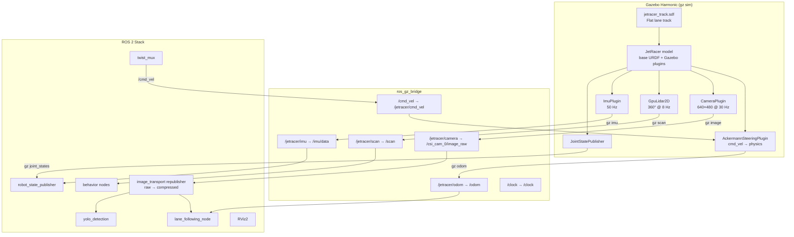

# 13. Gazebo Simulation

The `jetracer_gazebo` package provides a **Gazebo Harmonic (gz-sim 8)** simulation
that presents the same ROS 2 topic interface as the real JetRacer hardware.
The autonomous stack — lane following, YOLO, behavior nodes — connects to the
simulation without any code changes.

> [!IMPORTANT]
> The simulation never starts `jetracer_hardware`. Hardware motor drivers are
> explicitly excluded to prevent accidental commands to real hardware.

---

## Architecture



---

## Package Layout

```
src/jetracer_gazebo/
├── CMakeLists.txt
├── package.xml
├── config/
│   └── ros_gz_bridge.yaml       # 9 topic bridge rules
├── launch/
│   └── simulation.launch.py     # Main entry point
├── urdf/
│   └── jetracer_sim.urdf.xacro  # Gazebo plugin additions
└── worlds/
    └── jetracer_track.sdf       # Lane track world
```

---

## Simulated Sensors

| Sensor | Plugin | ROS 2 topic | Rate |
|---|---|---|---|
| Drive + Odometry | `AckermannSteeringPlugin` | `/odom`, `/tf` | 30 Hz |
| Camera (640×480) | `CameraPlugin` | `/csi_cam_0/image_raw` | 30 Hz |
| Camera Info | `CameraPlugin` | `/csi_cam_0/camera_info` | 30 Hz |
| LiDAR (2D, 360°) | `GpuLidar2D` | `/scan` | 8 Hz |
| IMU | `ImuPlugin` | `/imu/data` | 50 Hz |
| Joint States | `JointStatePublisher` | `/joint_states` | 30 Hz |
| Simulation clock | gz clock | `/clock` | — |

---

## Prerequisites

```bash
# Install Gazebo Harmonic + ROS 2 integration (run once)
sudo apt update
sudo apt install -y \
    ros-humble-ros-gz \
    ros-humble-ros-gz-sim \
    ros-humble-ros-gz-bridge \
    ros-humble-ros-gz-image \
    ros-humble-image-transport \
    ros-humble-image-transport-plugins \
    gz-harmonic

# Verify
gz sim --version   # should print Gazebo Harmonic 8.x.x
```

---

## Build

```bash
colcon build --packages-select jetracer_gazebo jetracer_description
source install/setup.bash
```

---

## Launch Commands

=== "With GUI"

    ```bash
    ros2 launch jetracer_gazebo simulation.launch.py gui:=true
    ```

=== "With GUI + RViz2"

    ```bash
    ros2 launch jetracer_gazebo simulation.launch.py gui:=true use_rviz:=true
    ```

=== "Headless (CI/server)"

    ```bash
    ros2 launch jetracer_gazebo simulation.launch.py gui:=false
    ```

=== "Custom spawn point"

    ```bash
    ros2 launch jetracer_gazebo simulation.launch.py \
        spawn_x:=1.5 spawn_yaw:=1.5708
    ```

### All Launch Arguments

| Argument | Default | Description |
|---|---|---|
| `world` | *(jetracer_track.sdf)* | Absolute path to .sdf world file |
| `robot_name` | `jetracer` | Gazebo entity name |
| `spawn_x` | `0.0` | Spawn X (metres) |
| `spawn_y` | `0.0` | Spawn Y (metres) |
| `spawn_z` | `0.05` | Spawn Z — slightly above ground |
| `spawn_yaw` | `0.0` | Spawn heading (radians) |
| `gui` | `true` | Show Gazebo GUI |
| `use_rviz` | `false` | Start RViz2 |
| `use_sim_time` | `true` | Use Gazebo simulation clock |
| `debug` | `false` | Verbose Gazebo logging |

---

## Driving the Simulation

### Keyboard teleop

```bash
source install/setup.bash
ros2 run teleop_twist_keyboard teleop_twist_keyboard
```

### Connect the autonomous stack

The simulation exposes the same topics as the real hardware, so the autonomy
stack connects directly:

```bash
# In a separate terminal (same ROS_DOMAIN_ID)
source install/setup.bash

ros2 launch jetracer_bringup autonomy.launch.py \
    start_camera:=false \
    start_base:=false \
    start_lidar:=false \
    use_sim_time:=true

# Enable lane following motion
ros2 param set /lane_following start true
```

> [!WARNING]
> `use_sim_time:=true` must be set on all nodes that connect to the simulation,
> otherwise they will reject messages with Gazebo timestamps.

---

## Safety Isolation

> [!CAUTION]
> If the simulation and a real JetRacer share the same network, use a different
> `ROS_DOMAIN_ID` for simulation to prevent simulated `cmd_vel` commands from
> reaching real hardware.

```bash
# All simulation terminals:
export ROS_DOMAIN_ID=42

# Real hardware terminals:
export ROS_DOMAIN_ID=0   # (or whatever the Jetson uses)
```

---

## Validation

```bash
# Check all expected topics appear
ros2 topic list | grep -E "cmd_vel|odom|scan|imu|csi_cam|joint_states|clock"

# Verify rates
ros2 topic hz /csi_cam_0/image_raw              # ~30 Hz
ros2 topic hz /csi_cam_0/image_raw/compressed   # ~30 Hz
ros2 topic hz /scan                             # ~8 Hz
ros2 topic hz /imu/data                         # ~50 Hz
ros2 topic hz /odom                             # ~30 Hz

# TF tree
ros2 run tf2_tools view_frames
ros2 run tf2_ros tf2_echo odom base_footprint

# Drive and observe odometry
ros2 run teleop_twist_keyboard teleop_twist_keyboard &
ros2 topic echo /odom --once
```

---

## World: `jetracer_track.sdf`

A minimal flat ground plane with white painted lane lines forming a
rectangular loop (~5 m × 1.2 m). Design goals:

- No physics-heavy objects — keeps simulation fast on dev laptops
- White lines on dark tarmac — matches the real lane detection environment
- No walls or obstacles — use a separate world for obstacle testing

```
  ┌─────────────────────────────────────────────┐
  │ ─── outer left line ──────────────────────  │
  │ ─── inner left line ──────────────────────  │
  │        ← lane ←     robot→  → lane →        │
  │ ─── inner right line ─────────────────────  │
  │ ─── outer right line ─────────────────────  │
  └─────────────────────────────────────────────┘
               end caps at X = ±2.0 m
```

---

## Known Limitations

| Limitation | Detail |
|---|---|
| Camera FOV | Sim uses 80° pinhole. Real IMX219 is ~160° fisheye. Lane geometry differs. |
| Ackermann approximation | Both front wheels get the same steering angle (no true differential). |
| GPU LiDAR | Requires GPU/rendering context. Replace with `lidar` sensor type for pure headless. |
| Compressed image | Requires `ros-humble-image-transport-plugins`; without it `/compressed` won't exist. |
| No simulated stop signs | YOLO testing requires adding props to the world SDF. |

---

> [!TIP]
> **Next Step:** See [RViz2 Workflow](15_rviz2_workflow.md) for remote visualization
> of both hardware and simulation data.
