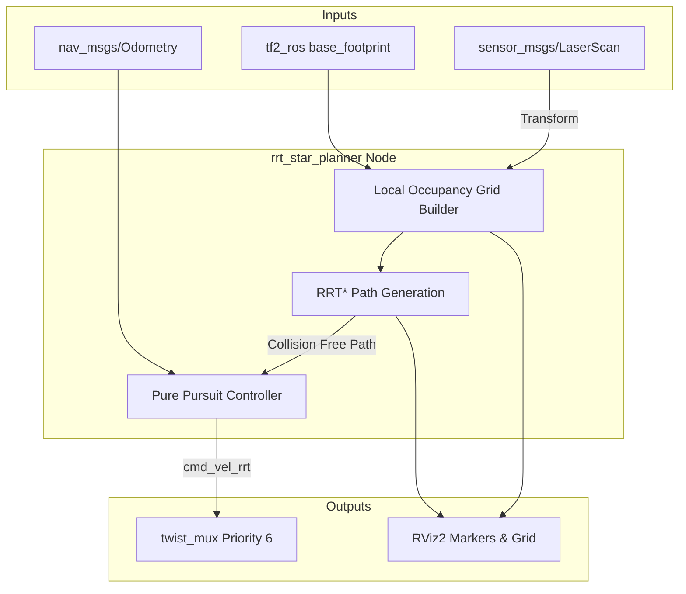

# 14. RRT* LiDAR Local Planner

The JetRacer autonomous stack includes an **RRT* (Rapidly-exploring Random Tree Star)** based local planner. This module allows the vehicle to safely navigate around obstacles using LiDAR data, without requiring a pre-built global map or full SLAM integration.

## Architecture

The `rrt_star_planner.py` node handles both the local occupancy grid generation and the path planning algorithm. It also includes a native Pure Pursuit controller to steer the JetRacer along the generated path.



## How It Works

1. **Local Grid**: The planner maintains an egocentric (robot-centered) 2D occupancy grid, typically 6x6 meters with a 5cm resolution.
2. **Obstacle Inflation**: Laser scan points are plotted onto the grid and inflated by an `inflation_radius` (e.g., 0.35m) to ensure the vehicle body clears obstacles.
3. **Goal Seeking**: If no explicit goal is provided, the planner attempts to drive straight ahead (exploratory goal). If the straight path is blocked, it samples random reachable points in the forward hemisphere.
4. **RRT* Execution**: The planner grows a tree of reachable states, optimizing the path cost (distance) and respecting simple kinematic constraints (preventing turns sharper than 45 degrees).
5. **Pure Pursuit Tracking**: The integrated controller calculates an Ackermann steering angle to follow the generated path, scaling the throttle down when cornering sharply.

## Usage

The RRT* planner is completely optional and disabled by default.

To start the planner on hardware:
```bash
ros2 launch jetracer_bringup autonomy.launch.py start_rrt:=true start_lane_following:=false
```

To run it in simulation:
```bash
# Terminal 1
ros2 launch jetracer_gazebo simulation.launch.py gui:=true use_rviz:=true

# Terminal 2
ros2 launch jetracer_bringup autonomy.launch.py start_camera:=false start_base:=false start_lidar:=false use_sim_time:=true start_rrt:=true start_lane_following:=false
```

> [!IMPORTANT]
> The RRT* planner operates at **Priority 6** in the `twist_mux`. If both `start_lane_following` and `start_rrt` are true, the RRT* planner will take precedence over the lane follower, allowing obstacle avoidance to override the centerline tracking.

## Configuration Parameters

Parameters are centralized in `src/jetracer_bringup/config/main_config.yaml`.

| Parameter | Default | Description |
| :--- | :--- | :--- |
| `planning_frequency` | `10.0` | Hz at which the planner generates a new path. |
| `max_planning_time_ms` | `30` | Maximum time allowed for RRT* execution to ensure real-time performance. |
| `max_iterations` | `400` | Maximum nodes added to the RRT* tree. |
| `grid_resolution` | `0.05` | Meters per cell in the local grid. |
| `inflation_radius` | `0.35` | Meters to inflate obstacles. Must be > half the robot width. |
| `step_size` | `0.25` | Distance between nodes in the RRT* tree. |
| `pure_pursuit_lookahead` | `0.6` | Lookahead distance for the tracking controller. |
| `max_speed` | `0.3` | Base forward velocity when path is straight. |

## Safety Mechanisms

The RRT* module implements several safety fallbacks:
1. **Stale LiDAR**: If the `/scan` topic stops updating for > 1 second, the node publishes zero-velocity commands.
2. **Blocked Path**: If no path can be found after `max_iterations` or `max_planning_time_ms`, the vehicle halts.
3. **Supervisor Override**: The `safety_supervisor` (Priority 255) and `collision_assurance` (Priority 8) remain active and can physically halt the vehicle if it gets too close to a wall, regardless of the planner's intent.
