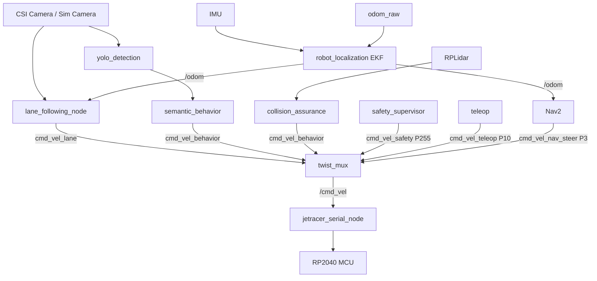

# JetRacer Docs Portal

## Start Here

Use this portal as the canonical operations guide for setup, deployment, and runtime behavior.

- Jetson Nano baseline and workaround [flow](00_ROS2-Jetson-Nano.md)
- Containerized runtime and launch [workflow](03_Deployment_and_Docker.md)
- Runtime tuning [reference](08_Central_Configuration.md)
- Gazebo simulation [guide](13_Gazebo_Simulation.md)
- RViz2 remote visualization [workflow](15_rviz2_workflow.md)

## Documentation Map

<div class="jr-grid">
  <a class="jr-card" href="00_ROS2-Jetson-Nano/">
    <strong>00. Jetson Nano Workaround: </strong>
    <span>Ubuntu 20.04 host workaround and compatibility rules.</span>
  </a>

  <a class="jr-card" href="01_System_Overview/">
    <strong>01. System Overview: </strong>
    <span>High-level architecture, core capabilities, and stack intent.</span>
  </a>

  <a class="jr-card" href="02_Hardware_and_Assembly/">
    <strong>02. Hardware and Assembly: </strong>
    <span>BOM, interfaces, and physical integration model.</span>
  </a>

  <a class="jr-card" href="03_Deployment_and_Docker/">
    <strong>03. Deployment and Docker: </strong>
    <span>Host prerequisites, container startup, and launch sequences.</span>
  </a>

  <a class="jr-card" href="04_Perception_Stack/">
    <strong>04. Perception Stack: </strong>
    <span>Lane follower and YOLO perception pipelines.</span>
  </a>

  <a class="jr-card" href="05_Navigation_and_SLAM/">
    <strong>05. Navigation and SLAM: </strong>
    <span>Localization, mapping, and navigation behavior.</span>
  </a>

  <a class="jr-card" href="06_Behavior_and_Arbitration/">
    <strong>06. Behavior and Arbitration: </strong>
    <span>Priority orchestration through twist mux.</span>
  </a>

  <a class="jr-card" href="07_Voice_Commander_Stack/">
    <strong>07. Voice Commander Stack: </strong>
    <span>Offline voice command flow and goal dispatch.</span>
  </a>

  <a class="jr-card" href="08_Central_Configuration/">
    <strong>08. Central Configuration:</strong>
    <span>Single-source runtime tuning via main config YAML.</span>
  </a>

  <a class="jr-card" href="09_Technical_Architecture/">
    <strong>09. Technical Architecture: </strong>
    <span>Nodes, topics, launch profiles, safety layer, and extension guidelines.</span>
  </a>

  <a class="jr-card" href="10_Runtime_Tuning/">
    <strong>10. Runtime Tuning Guide: </strong>
    <span>Real-time adjustments via Foxglove, CLI, and RQT.</span>
  </a>

  <a class="jr-card" href="11_Operational_Guide/">
    <strong>11. Operational Guide: </strong>
    <span>Startup, Mission Control, and Gamepad procedures.</span>
  </a>

  <a class="jr-card" href="12_Camera_Calibration/">
    <strong>12. Camera Calibration Guide: </strong>
    <span>Camera Calibration for **IMX219-160** wide-angle CSI camera.</span>
  </a>

  <a class="jr-card" href="13_Gazebo_Simulation/">
    <strong>13. Gazebo Simulation: </strong>
    <span>Simulate the full stack with Gazebo Harmonic — camera, LiDAR, IMU, and Ackermann drive.</span>
  </a>

  <a class="jr-card" href="14_RRT_Local_Planner/">
    <strong>14. RRT* Local Planner: </strong>
    <span>Hardware-aware obstacle avoidance using LiDAR, an egocentric grid, and Pure Pursuit.</span>
  </a>

  <a class="jr-card" href="15_rviz2_workflow/">
    <strong>15.RViz2 Workflow: </strong>
    <span>Remote visualization, profiles, and per-topic debugging for hardware and simulation.</span>
  </a>

</div>

## Architecture at a Glance



## Build The Docs Site

```bash
pip install -r requirements-docs.txt
mkdocs serve
```

Static build output:

```bash
mkdocs build
```
